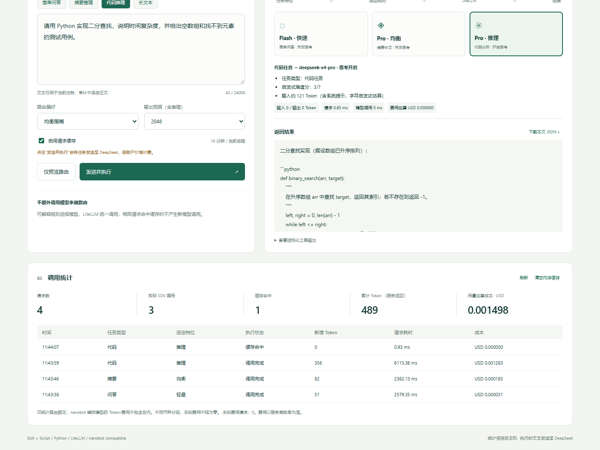

# RouteLab · AI 模型智能路由

《智能体开发实战》第 25 题。按自然语言任务的类型、难度、长度和偏好选型，通过 **LiteLLM 1.101.0** 调用 **DeepSeek 真实 API**。提供本地网页、独立 JSON CLI、可被 **nanobot 0.3.5** 加载的 Skill、用量看板、实验报告和一分钟内演示视频。



## 快速启动

建议 Python 3.11 或 3.12，已在 Windows + Python 3.11.9 实测。双击 **start-demo.bat**，浏览器打开 http://127.0.0.1:8765 。首次缺少环境时自动安装依赖；模型生成需要网络和有效 API 余额。关闭终端或 Ctrl+C 可停止服务。

手动安装和运行：

```powershell
py -3.11 -m venv .venv
.\.venv\Scripts\python.exe -m pip install --require-hashes -r requirements-lock.txt
.\.venv\Scripts\python.exe -m pip install -r requirements-dev.txt -r requirements-nanobot.txt
.\.venv\Scripts\python.exe app.py --open-browser
```

Linux/macOS 使用 `.venv/bin/python`。端口冲突时加 `--port 8766`。

## 动态 API 配置

页面右上角 **API 配置 → 输入 DeepSeek Key → 保存并立即生效 → 测试连接**。无需修改代码或重启。密码框不回填旧值，保存后清空；更换密钥清除内存缓存。测试连接读取官方模型列表，不生成文本。

Windows 使用 DPAPI 加密，文件为本机 `runtime/settings.json`，绑定当前 Windows 用户；其他系统使用权限 0600 的本地文件。该文件、数据库及虚拟环境不进入 Git 或提交压缩包。换电脑后重新在页面配置即可。已有环境变量 `DEEPSEEK_API_KEY`（兼容 `ROUTER_API_KEY`）也可使用，本地已保存密钥优先；“移除本地密钥”后会回退环境变量。

命令行安全输入：`.venv\Scripts\python.exe scripts\configure_key.py`。密钥不作为命令行参数。固定官方端点 https://api.deepseek.com ，不接受任务请求覆盖地址。

## 两个真实模型，三个档位

| 档位 | 模型 | 模式与任务 |
|---|---|---|
| eco | deepseek-flash | 关闭思考，简单问答 |
| balanced | deepseek-v4-pro | 关闭思考，摘要与长文本 |
| reasoner | deepseek-v4-pro | 开启思考，代码与复杂推理 |

这三个档位对应两个模型，不把不同参数档位说成三个独立模型。当前配置按 [DeepSeek 官方价格](https://api-docs.deepseek.com/quick_start/pricing/) 和 [思考模式](https://api-docs.deepseek.com/guides/thinking_mode/) 核对，日期 2026-09-17。公开费率放在 `skills/ai-model-router/config/models.json`，价格变化时需更新。

路由是可解释规则，不额外调用分类模型；Token 预估是字符启发式。生成后的用量来自接口 usage。费用考虑供应商输入缓存命中/未命中和请求开始时的 UTC 峰谷单价，仍属估算，以账户账单为准。输出预算包含推理 Token；预算耗尽会明确提示，不缓存不完整回答。深度推理只展示最终答案，不保存推理正文。

## Skill + Script 与 nanobot

`skills/ai-model-router/` 可整体复制进 nanobot 的 workspace/skills。项目根目录也是一个现成工作区。

```powershell
.\.venv\Scripts\python.exe skills\ai-model-router\scripts\router.py plan --prompt "请用 Python 实现二分查找并分析复杂度"
.\.venv\Scripts\python.exe skills\ai-model-router\scripts\router.py run --prompt "用一句话解释机器学习" --confirm-live
.\.venv\Scripts\python.exe skills\ai-model-router\scripts\router.py stats
$OutputEncoding=[Text.UTF8Encoding]::new()
Get-Content -Raw -Encoding utf8 examples\summary.json | .\.venv\Scripts\python.exe skills\ai-model-router\scripts\router.py run --json-stdin
.\.venv\Scripts\python.exe scripts\verify_nanobot.py
```

`run`、示例 JSON 及 nanobot 验证会发送公开任务并产生实际费用；`plan` 不生成文本。未授权时 CLI 不执行真实生成。nanobot 验证实际使用 SkillsLoader 与受限 ExecTool 执行真实模型脚本，证据见 artifacts/nanobot-verification.json。完整自然语言编排说明见 [nanobot 指南](docs/nanobot.md)。

## 测试与实测

```powershell
.\.venv\Scripts\python.exe -m pytest -q --junitxml=artifacts/test-results.xml
.\.venv\Scripts\python.exe scripts\evaluate.py
.\.venv\Scripts\python.exe scripts\evaluate.py --live
```

前两项不用模型 API；最后一项明确授权三次真实生成，再执行三次缓存请求。保存的实测：6 次请求、3 次 API 调用，后 3 次没有新增 Token/费用；首轮用量和估算费用见 evaluation.json。单元测试中的替身仅用于确定性校验，不是产品运行模式。

缓存为当前进程内 128 条、10 分钟 TTL；独立 CLI 进程不共享。SQLite 审计仅保存哈希、状态、用量、费用、耗时，不保存正文、答案、密钥。未知 usage/费用不会记成免费；失败不缓存，不自动重试。页面只监听 127.0.0.1，验证 Host/Origin，不执行生成的代码。
